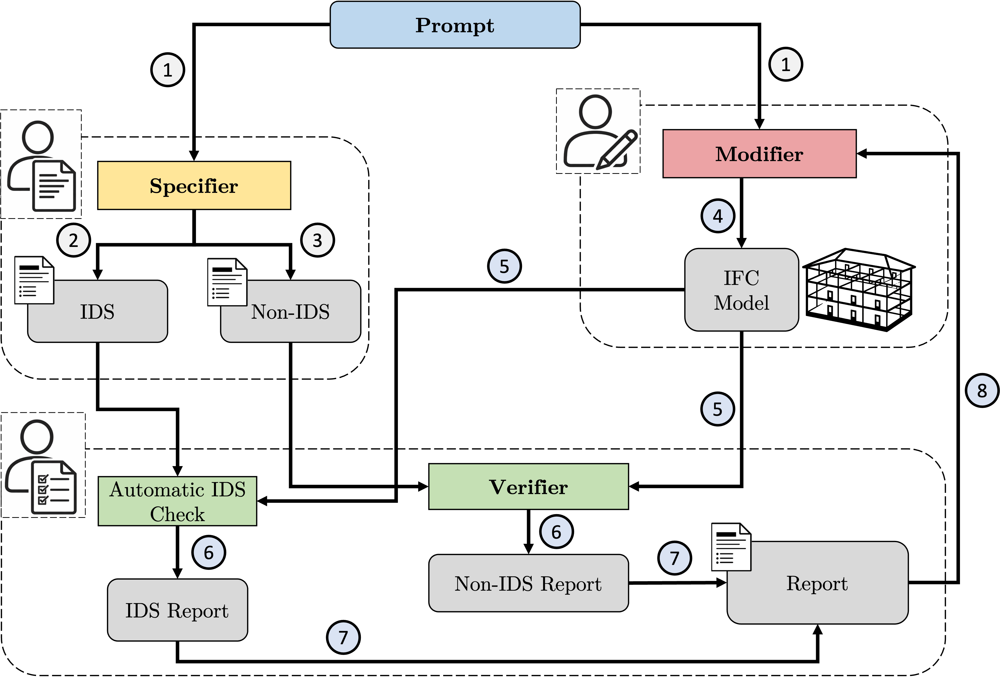

# A Self-Verification Framework Toward Reliable Text-to-BIM Generation

> Implementation of the paper *A Self-Verification Framework Toward Reliable Text-to-BIM Generation*.


This repository realizes the paper's closed-loop Text-to-BIM workflow in code. A natural-language building prompt is translated into an IFC model and iteratively improved through two complementary validation channels:

- an Information Delivery Specification (IDS) for formal, rule-based checks
- an LLM-based verifier for requirements that are difficult or impossible to express in IDS alone

The repository is therefore both a research prototype of the paper's framework and a runnable codebase for reproducing and extending the workflow.

## Framework Overview



The implementation follows the paper's three-agent architecture:

- **Specifier**: derives two specification artifacts from the user prompt:
  - `spec.md` for non-IDS requirements, written as atomic `REQ-###` items
  - `requirements.ids` for formally expressible IDS constraints
- **Modifier**: creates or updates an IFC model to satisfy the prompt and later patch plans
- **Verifier**: inspects the IFC against `spec.md` and produces a structured review report

In parallel to the Verifier, the system runs an IDS validation step with IfcTester. Both reports are merged into a patch plan that drives the next modification iteration.

In short, the loop is:

`prompt -> specification -> IFC generation/modification -> verifier report + IDS report -> merged patch plan -> next iteration`

## Repository Structure

- `src/main.py`: command-line entrypoint
- `src/orchestrator.py`: coordinates the full Specifier-Modifier-Verifier loop
- `src/specifier.py`: prompt-to-specification generation
- `src/modifier.py`: LLM-based IFC editing with local IFC tools
- `src/mcp_modifier.py`: MCP-based modifier backend
- `src/reviewer.py`: LLM-based verifier using read-only IFC inspection tools
- `src/mcp_reviewer.py`: MCP-based verifier backend
- `src/ids_tools.py`: IDS validation helpers
- `src/ids_builder.py`: compiles the specifier's IDS plan into valid IDS XML
- `src/merge.py`: merges verifier and IDS results into a patch plan
- `src/tools_ifc.py`: IFC utility and editing/query functions
- `case_study/`: artifacts from the paper's example case study

## Outputs Per Run

A run creates a timestamped output directory inside the path passed via `--out`, for example `run_out/run_<timestamp>/`.

Typical artifacts are:

- `spec.md`: non-IDS specification used by the Verifier
- `requirements.ids`: IDS document used for formal validation
- `assumptions.json`: assumptions made during specification generation
- `specifier_trace.jsonl`: Specifier trace
- `iter_<n>/model.ifc`: IFC model for iteration `n`
- `iter_<n>/review_report.json`: Verifier output for iteration `n`
- `iter_<n>/ids_report.json`: IDS validation output for iteration `n`
- `iter_<n>/modifier_trace.jsonl`: Modifier trace for iteration `n`
- `iter_<n>/reviewer_trace.jsonl`: Verifier trace for iteration `n`
- `final_summary.json`: latest merged state and stopping summary

## Installation

Install the Python dependencies:

```bash
pip install -r requirements.txt
```

This project also depends on the MCP4IFC framework for Blender:
https://github.com/Show2Instruct/ifc-bonsai-mcp

After installing it, update the corresponding entry in `mcp.config.json` so it points to your local MCP4IFC setup.

The LLM components require an OpenAI-compatible API key:

```bash
export OPENAI_API_KEY="..."
```

## Running The Framework

Run the default example:

```bash
python src/main.py
```

Run with an explicit prompt and output directory:

```bash
python src/main.py \
  --prompt "Create a simple but realistic house, 4 rooms per level, 2 levels, made out of wood. The roof should be a gable roof." \
  --out run_out
```

Useful options:

- `--max-iters`: maximum number of refinement iterations
- `--model-specifier`: model used by the Specifier
- `--model-modifier`: model used by the Modifier
- `--model-reviewer`: model used by the Verifier
- `--modifier-backend {llm,mcp}`: choose local-tool or MCP modifier
- `--reviewer-backend {llm,mcp}`: choose local-tool or MCP verifier
- `--mcp-config`: path to the MCP configuration file

## Backends

Two execution styles are supported for modification and verification:

- `llm`: uses the local IFC tool wrappers from [src/tools_ifc.py](/src/tools_ifc.py)
- `mcp`: uses MCP tools configured in [mcp.config.json](mcp.config.json)

The included MCP configuration is set up for a Blender MCP server and `openai:gpt-5.2`.

## Case Study

The repository contains a case-study folder corresponding to the paper's demonstration prompt:

> "Create a simple but realistic house, 4 rooms per level, 2 levels, made out of wood. The roof should be a gable roof."

The [case_study](/case_study) directory includes:

- the generated specification artifacts
- intermediate IFC models across iterations
- IDS and verifier reports
- a final summary of the refinement process

This is useful both as a reproduction artifact for the paper and as a reference for the repository's expected outputs.

## Notes And Limitations

- This is a research prototype implementing the paper's framework, not a hardened production system.
- `ifc_python_exec` is powerful but not a security sandbox.
- The quality of the final IFC depends on specification quality, tool availability, and model behavior across iterations.
- IDS and LLM-based verification are complementary; neither alone covers the full range of BIM requirements discussed in the paper.

## Citation

> Citation coming soon.
